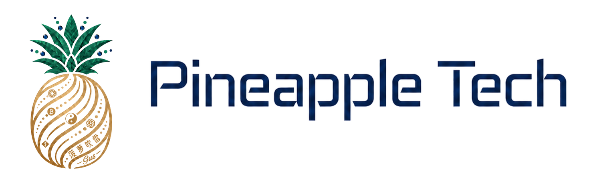

# Friends-thoughts

朋友们的奇思妙想：把值得尝试的想法整理成项目说明、产品方案、可运行原型和验证记录，方便朋友们一起讨论、改进与复用。

<picture>
  <source media="(prefers-color-scheme: dark)" srcset="assets/pineapple-tech-dark.png">
  
</picture>

作者与维护者：**Pineapple-Tech 菠萝吹雪**。

## 项目目录

| 项目 | 解决的问题 | 当前阶段 |
| --- | --- | --- |
| [求职自动化投递 Agent](projects/job-search-agent/README.md) | 基于本人确认的经历与 JD，解释匹配、准备真实材料并跟踪求职结果 | v0.3，本地准备 Skill 与 CLI 原型；正式来源与提交待实现 |

每个项目放在独立的 `projects/<project-name>` 目录中，说明要解决的问题、实际可用的功能、运行方式、测试证据和下一步。设计、原型和生产验收分别标注；新的想法可以先从项目说明开始，再逐步形成可验证的成果。

## 使用与贡献

进入对应项目的 README，按项目要求安装依赖、运行合成示例和测试。真实简历、账号凭证、邮箱数据与密钥应保存在仓库之外。

欢迎通过 Issue 讨论使用场景、设计缺口或测试反例，通过 Pull Request 提交文档或代码修改。请保留来源与贡献者署名，注明新增功能是否实际运行验证。

## 许可与品牌

当前尚未指定源代码或文档的开源许可证，具体说明见 [NOTICE.md](NOTICE.md)。Pineapple Tech 的名称、Logo 和品牌素材单独管理，见 [BRAND.md](BRAND.md)；不因仓库公开而自动授予品牌使用权。
