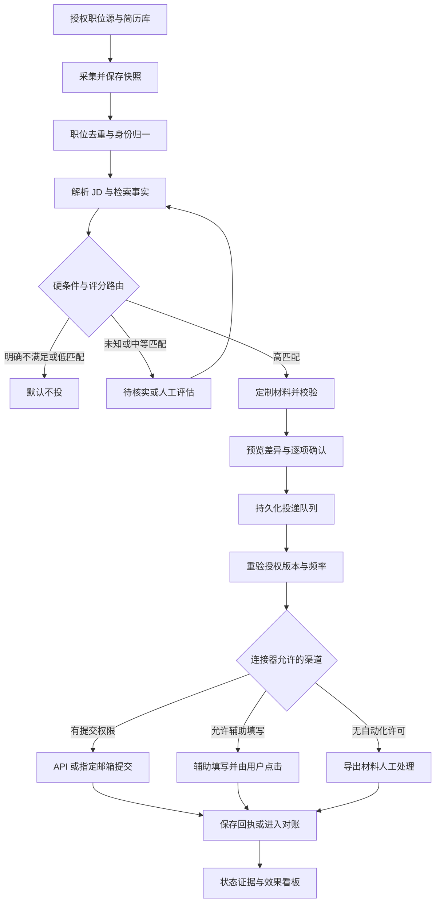

## 工作流

### 执行职责与主流程

编排器和规则引擎控制状态。JD 解析、证据映射、材料写作、质量审查、状态分类是逻辑模块，可用同一模型的隔离调用实现；第一版无需多个拥有广泛工具权限的自主 Agent。模型只处理输入数据和生成候选输出，不持有邮箱发送或 ATS 写入凭证。

1. 授权：选择源 allowlist、简历版本、用途、地区、预算及读写权限；先启动 dry_run，连接器未准入不能启动采集。
2. 采集：按源限额获取增量；保存原始快照哈希、更新时间、分页 cursor、ETag 或邮件 message_id。RSS 缺全文只作为线索，不推测要求。
3. 去重：相同源和 external_id 做精确 upsert；跨源优先同一雇主 requisition_id 或明确 canonical application URL，再比较公司主体、标题、地点和描述。语义相似仅生成候选对，不能直接合并不同岗位。保留所有原始来源。
4. 解析：保留薪资单位、要求类型及原文偏移；无法解析时进入 NEEDS_INFO。职位更新生成新 job_version，不覆盖已确认版本。
5. 匹配：从同一用户已确认事实库检索；代码计算硬条件、上下界、覆盖率和路由。简历冲突先处理，不能跨版本任意拼接。
6. 定制：只为高匹配或用户明确选中的岗位生成完整材料；关联所有 claim 与事实、版本及模型调用。
7. 审查：结构、事实、数字、日期、敏感数据、必填答案、文档可读性和占位符检查；失败进入 NEEDS_INFO。
8. 确认：向用户展示完整预览；保存版本签名、审批人、时间、失效时间及确认范围。
9. 执行：先将冻结 payload 与任务写入 outbox。执行器准备好对外调用后，在最终派发事务中锁定申请与授权版本，重验完整闸门及当前时间窗口配额，仅允许 QUEUED 条件更新为 SUBMITTING；绑定唯一 operation、attempt 和发送许可 token 后提交事务，随后立即执行相应动作。辅助填写不自动点击最终按钮；若平台不允许辅助填写则只导出。填值和独立附件上传可能已披露数据，须提前取得绑定目的地、内容和 prefill 或 upload 范围的确认；本地预览和导出不触发外部披露。
10. 跟踪：有官方获授权状态接口则读接口；否则从授权邮箱和用户录入提取证据。岗位关闭不等于申请被拒，长时间无消息显示“暂无更新”，不虚构拒绝。
11. 看板：按提交 cohort 汇总；用户更正作为新事件保存，不删掉原始判断。失败、需用户动作或重要进展通知用户，日常未变化状态不重复通知。

### 两套状态机

准备与执行状态：
`DISCOVERED → PARSED → SCORED → DRAFTING → AWAITING_APPROVAL → QUEUED → SUBMITTING`。其中 SCORED 可分流至 BLOCKED、LOW_MATCH、REVIEW、NEEDS_INFO；DRAFTING 审查不通过转 NEEDS_INFO；拒绝或撤销转 CANCELLED；审批到期或载荷变化退回 AWAITING_APPROVAL。

SUBMITTING 的结果为 ACCEPTED、SENT、ASSISTED_READY、SUBMISSION_UNKNOWN 或 FAILED。FAILED 只用于已证明未被接收的失败；邮件已发送后收到退信记录 DELIVERY_FAILED，保留原 SENT 证据并禁止自动重发。只有 ATS 有明确接收证据才是 ACCEPTED；邮箱供应商接受发送请求为 SENT，不代表招聘方收到；辅助填写停在 ASSISTED_READY，用户点击后依证据记 ACCEPTED 或 SELF_REPORTED_SUBMITTED。这些已发送或已提交状态均禁止自动重复执行。SUBMISSION_UNKNOWN 独立占住申请槽位。

招聘进展状态单独保存：
`NO_UPDATE、ACKNOWLEDGED、REPLIED、SCREENING、INTERVIEW、OFFER、REJECTED、WITHDRAWN`。面试还可用 interview_round 子字段。邀请安排面试不等于用户确认出席；WITHDRAWN 必须有用户或平台证据。状态进展不能替代投递执行证据。

### 幂等与故障恢复

业务唯一键为 `user_id + canonical_job_id + application_cycle`；默认 cycle 为 1，渠道或材料变化不能生成新 cycle。重新投同一岗位必须由用户明确创建新轮次；职位重新上架须确认确属新的招聘轮次。

业务申请槽位始终不变；传输 idempotency_key 按冻结 payload 的同一次 submission_operation 固定，operation 内所有重试复用，attempt_id 每次独立。只有证明旧操作未被外部接收或未发出，才可关闭旧操作、修改载荷并重新确认后创建新 operation/key；SUBMISSION_UNKNOWN 禁止换键、换渠道或换轮次。payload_hash 包含目的地、JD 版本、文档哈希、questionnaire_schema_hash、全部答案、隐私通知版本、隐私选择、operation_scopes 和政策版本，不含临时签名 URL。问题 schema 冻结 ID、文本、类型、必填规则和选项；同字段答案未变但问题文本改变也使确认失效。数据库唯一约束、行锁、状态 CAS 和唯一 active operation 阻止并发重复准入。

本地事务与外部提交不能形成一个全局事务。outbox 保证任务可恢复，不能单独保证外部只收到一次。只有平台支持且已核实语义的幂等键才可安全复用重试。发送后超时、连接中断或 worker 崩溃但无接收证据，一律 SUBMISSION_UNKNOWN：先查获授权回执或已发送记录，再人工核实，禁止直接再次 POST 或发邮件。固定邮件 Message-ID 仅帮助对账，不保证服务器去重。

读操作按退避重试；写操作只在平台证明未接收或支持可靠幂等时重试。HTTP 400/422 修材料并重新确认；401 暂停并重授权；403 停用连接器审查；429 遵守 Retry-After；5xx 写请求可能已产生副作用，先对账。重试不换 IP、不更换身份，也不静默改用另一渠道。

取消、撤权和发送许可使用同一授权 epoch 与锁定次序，以最终派发事务签发许可并提交为边界。取消或撤权生效后不得签发新发送许可；已获许可的请求可能已经在途，显示“取消请求已记录，提交结果待核实”。发送器不得在签发许可后再次排队等待，队列等待期间须在派发时重新核验自然到期的审批、grant、ToS 审查期限、岗位与事实版本。每个 operation 仅一个 active attempt，token 防止旧任务重新准入；未知副作用不能只靠租约过期重新派发。租约恢复将过期 SUBMITTING 送往对账，不能自动重置 QUEUED。

### 频控与暂停

建议默认：源采集每 60 分钟一次、单源并发 1；用户每日最多 10 次对外申请；同一用户对同一公司每天最多 2 次；用户提交间隔至少 60 秒；模型每日费用设用户预算，单次费用上限可配置。平台更严格的限制、官方额度、用户限额和风险规则同时生效，按各个时间窗口分别取约束，不把不同窗口简单折算。

Redis 可作为限流缓存，持久配额账本保存在数据库；缓存失败默认暂停外发。任务占用配额须带申请 ID，失败释放仅限能证明未发送的请求；结果未知不退额度。多 worker 共享原子配额，不用单进程计数。

连接器文档、认证失败或 ToS 发生变化即暂停相关能力；验证码、双重认证或风险验证交给用户；既不求解验证码，也不自动重复触发验证。提供用户级、来源级和系统级急停，停掉尚未发出的 outbox，保留审计和已在途结果。

### 两阶段评估与中文材料闭环

JD 先保留来源标签、原文和要求证据；user_provided 不等于已核实真实或仍开放。廉价排序采用岗位相关信号与用户确认偏好，禁止敏感属性和代理变量，只影响调度先后。每个 evaluation_run 独立记录 UNASSESSED、DEFERRED、RUNNING、COMPLETED、FAILED 或 CANCELLED；只有完整成功结果生成 match_result。延后与失败不能标为 LOW_MATCH，全部可见并可重评。

事实及其映射未经本人核实保持 unknown。按现有上下界和硬条件评分；确认事实变化后旧映射及材料标记陈旧。材料按事实引用生成，独立审查项目归属、数字、日期、技能和责任级别；原句之外的语义真实性继续人工核实。接受 patch 核验基础版本和 hash，创建新草稿并清除预览绑定；不会确认新事实或签发披露许可。材料冻结之后的任何内容变动仍使原审批失效。

DOCX/PDF 生成后进入 CHECK_PENDING；文本、关键字段、密码与中文字符检查失败为 FAIL，阻止外发确认。渲染与逐页视觉审查完成才记 PASS；只抽出文字不能证明分页、裁切或字体正确。检查报告及输出文件 hash 绑定材料版本。

邮件未唯一归属进入 UNRESOLVED，人工选择后为 LINKED 或 IGNORED。重放同邮件不重复生效；同源事件 ID 正文 hash 不同隔离处理。人工改关联生成独立 correction event UUID，supersedes_id 指向旧事件，并保留原邮件证据及决定者。不能复用原邮件事件键插入第二条状态，亦不能覆盖原判断。

cohort 采用有效事件链首个有效提交时间作为锚点；ATS ACCEPTED、邮件 SENT、SELF_REPORTED_SUBMITTED 分层，UNKNOWN 单列。occurred_at 控制观察窗，observed_at 与 as_of 控制可见事件；面试后被拒仍计曾面试，更正撤销后重算。浏览器返回或拖动状态列只记人工声明，不能当平台回执。
