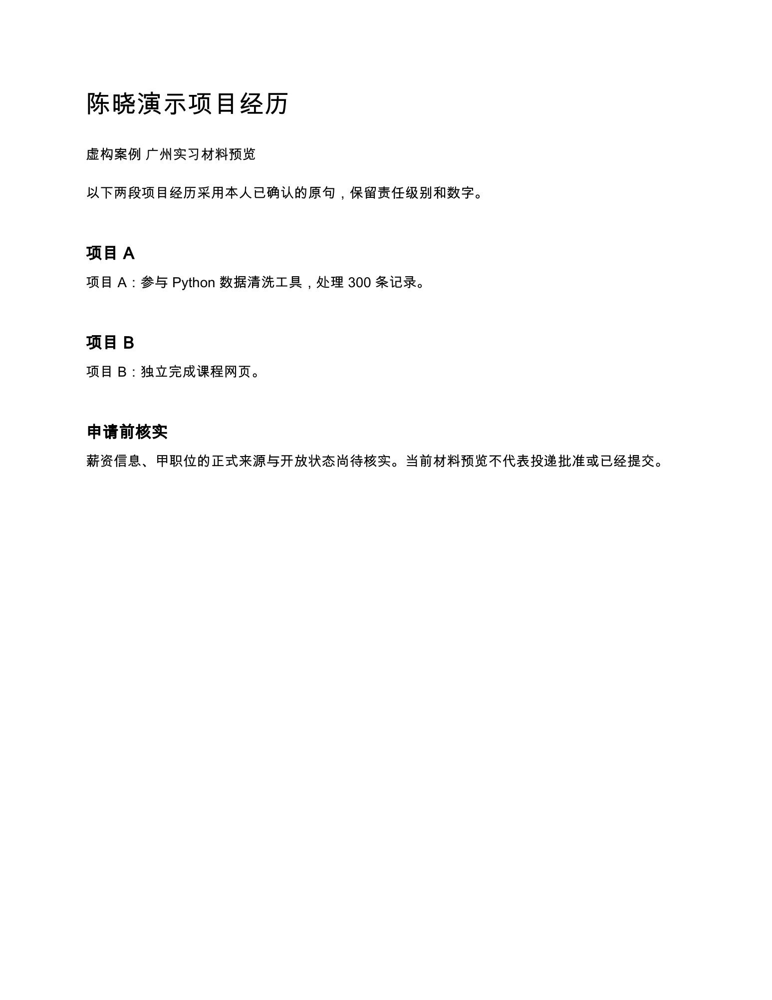

# 求职自动化投递 Agent

帮助求职者用本人确认的经历和岗位原文准备申请：解释为什么匹配、哪里缺证据、材料改了什么，并保留求职状态的来源。目标是在获准渠道中完成准备、人工确认与投递闭环。

**当前版本：v0.3，M1 本地准备原型。** 已交付中文 Skill 和无外部依赖的 Node.js 辅助脚本。正式职位采集、邮件同步、辅助填写及提交仍是后续设计；高分只产生待审建议。当前没有外发工具。

作者：**Pineapple-Tech 菠萝吹雪**。

## 功能与实施范围

| 功能 | 当前可用 | 仍待实现或验收 |
| --- | --- | --- |
| 经历与 JD | 导入本地结构化候选，分别确认事实与证据映射 | 宿主模型负责分析原材料；CLI 没有自动解析或 LLM 调用器 |
| 可解释评分 | 六维权重、分数上下界、证据覆盖率、硬条件与未知项路由 | 大样本校准、真实岗位评估；分数不是录用概率 |
| 材料审查 | 检查引用、原句、数字、项目归属、部分技能和责任级别 | 任意改写、翻译与事实性标题需人工核实；无法自动证明语义真实 |
| 草稿修改 | 验证基础摘要和事实快照，修改已有简历段落正文 | 仅保留最新草稿与审计摘要，尚无完整正文历史版本库 |
| 求职跟踪 | 追加本人自报事件、重放防重、更正与历史观察窗统计 | 平台回执、邮箱归属复核和正式状态同步 |
| 本地数据 | AES 256 GCM、独立密钥、目录权限、排他锁与原子落盘 | 生产身份、租户隔离、KMS、密钥轮换、独立防篡改审计和删除流程 |
| 中文文档 | 提供一份虚构 DOCX/PDF 演示及检查结果 | CLI 没有简历生成器或 DOCX/PDF 渲染器；自动文档流水线尚未实现 |
| 职位源与投递 | 已有 API/RSS/邮件优先的产品与技术设计 | M2 只读接入；M3 获准渠道、持久队列、频控、幂等、对账及本人确认后提交 |

系统默认低匹配不投，高匹配经本人审核后才进入正式系统的待提交队列。读取职位的权限不等于提交、上传或填写权限；验证码由本人处理，不采用反检测或代理轮换。

## 如何使用

运行环境：Node.js 20 或更新版；本轮在 macOS、Node.js 24.21.0 验证。本地文件权限和目录落盘行为尚未在 Windows 验收。

安装中文 Skill 时，将 `skills/job-search-agent` 复制到宿主 Agent 的 Skills 目录；已有同名版本时先比较文件，不直接覆盖。Codex 的常用位置是 `~/.codex/skills/job-search-agent`。

```text
使用 $job-search-agent，根据我提供的简历和 JD 整理经历证据。
先列出需要我确认的事实和岗位要求，再解释分数、未知项和缺口。
只基于我确认的事实准备简历与求职信，显示修改前后差异。
```

Skill 引导宿主模型准备结构化候选，Node.js 脚本执行确定性评分、审查和本地管理。安装请求、模型输出、输入 JSON 里的状态字段都不能替代本人事实确认或投递批准。

CLI 的全部命令与输入格式见 [本地运行说明](skills/job-search-agent/references/local-runtime.md)。实际案例与密钥应放在不同的私有目录，均位于 Git 仓库之外。仅知道事件日期时保留日期精度，不补造具体时刻；当前 CLI 需要已知 UTC 时间。

## 运行合成测试

在仓库根目录进入本项目：

```bash
cd projects/job-search-agent
node prototype-tests/run.mjs
python3 -m venv .venv
.venv/bin/python -m pip install -r selfcheck/requirements.txt
.venv/bin/python selfcheck/check_v03_contracts.py
.venv/bin/python selfcheck/run_checks.py --output selfcheck/v0.3-regression-results.json
```

Python 检查要求 Python 3.9 或更新版。Node.js 运行不需要 npm 包。测试使用合成经历与 JD，在系统临时目录创建独立案例和测试密钥；不调用模型、平台、邮箱或招聘方。

| 验证 | 已保存结果 | 证明范围 |
| --- | --- | --- |
| 实际模块与 CLI | [71/71](prototype-tests/results.json) | 评分、材料审查、patch、事件、cohort、加密、锁及 CLI 的合成测试 |
| 新合同 | [114/114](selfcheck/v0.3-contract-results.json) | JSON Schema 结构与模型 Proposal/Draft 信任边界 |
| 原合同与文档回归 | [205/205](selfcheck/v0.3-regression-results.json) | Schema、文档同步与离线参考语义 |
| 独立复验 | [脱敏摘要](prototype-tests/independent-summary.json) | 两个忠实中文 JD、缺证阻断、标题与项目上下文、手工状态和一页中文排版 |

各套件有重叠，不能把总条数当作独立岗位样本或端到端投递次数。这些结果不证明真实面试率、正式平台权限或生产安全。完整目标样本和发布门槛见 [验收指标](06_验收指标.md)。

## 文档导航

| 文档 | 内容 |
| --- | --- |
| [PRD](01_PRD.md) | 用户故事、功能优先级、六维评分、人工确认与实施阶段 |
| [工作流](02_工作流.md) | 准备、提交与招聘状态、幂等、异常、频控和更正 |
| [工具清单](03_工具清单.md) | 授权源、连接器准入、API/RSS/邮件和工具接口 |
| [数据 Schema](04_数据Schema.md) | 实体关系、版本、归属、约束与保留删除 |
| [JSON Schema](model-contracts.schema.json) | 结构合同；合同存在不代表相应数据库和服务已实现 |
| [提示词](05_提示词.md) | 解析、证据、材料、审查、补证和面试故事候选 |
| [验收指标](06_验收指标.md) | 离线、沙箱、试点、效果口径与发布门槛 |
| [测试与自检报告](07_测试与自检报告.md) | 修复记录、测试证据、证明范围与尚未执行的验收 |
| [GitHub 竞品与技能适配](08_GitHub竞品与技能适配建议.md) | 九个仓库的固定提交研究、可借鉴机制及许可边界 |
| [v0.3 交付记录](09_v0.3交付记录.md) | 当前可用能力、独立案例、中文排版和后续顺序 |
| [完整设计](求职自动化投递Agent设计.md) | 设计文档与交付记录的合并阅读版 |

## 虚构演示

[演示 DOCX](prototype-demo/陈晓虚构演示.docx)、[演示 PDF](prototype-demo/陈晓虚构演示.pdf) 使用虚构陈晓材料，保留“参与”责任级别和 300 条记录，不是任何真实求职者的简历。最终一页 PDF 完成关键文本提取和目视检查，不代表已达成多模板、多语言文档验收。



## 下一步

M2 先接一条获准的官方只读职位源，验证增量、去重、来源证据、关闭状态、429 冷却及预算，再接 RSS 或专用邮箱。M3 实现可信身份、不可变申请包、持久投递队列、完整 Schema 校验、频控、幂等、对账和独立审计，完成沙箱与本人逐岗审核后再启用实际提交。

当前代码为独立实现，没有移植竞品代码。公开包排除了个人案例、密钥、内部命令日志、本机路径和私有 Page 链接。许可状态见仓库 [NOTICE.md](../../NOTICE.md)，品牌规则见 [BRAND.md](../../BRAND.md)。
